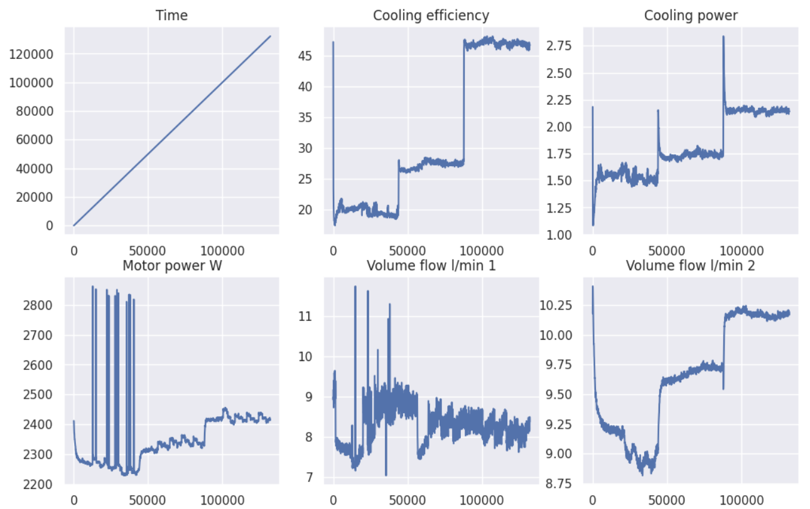
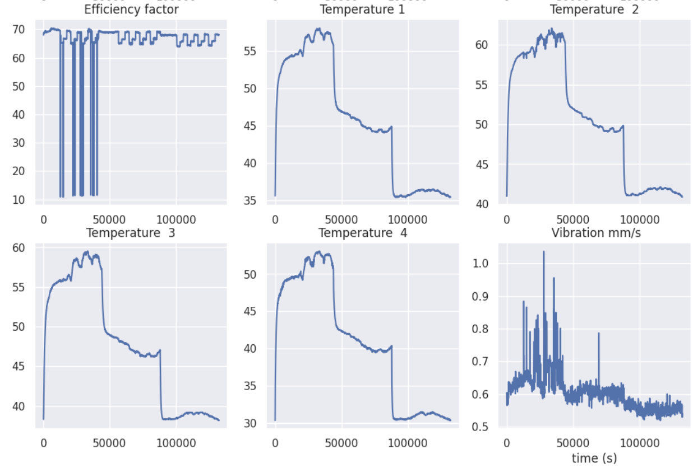
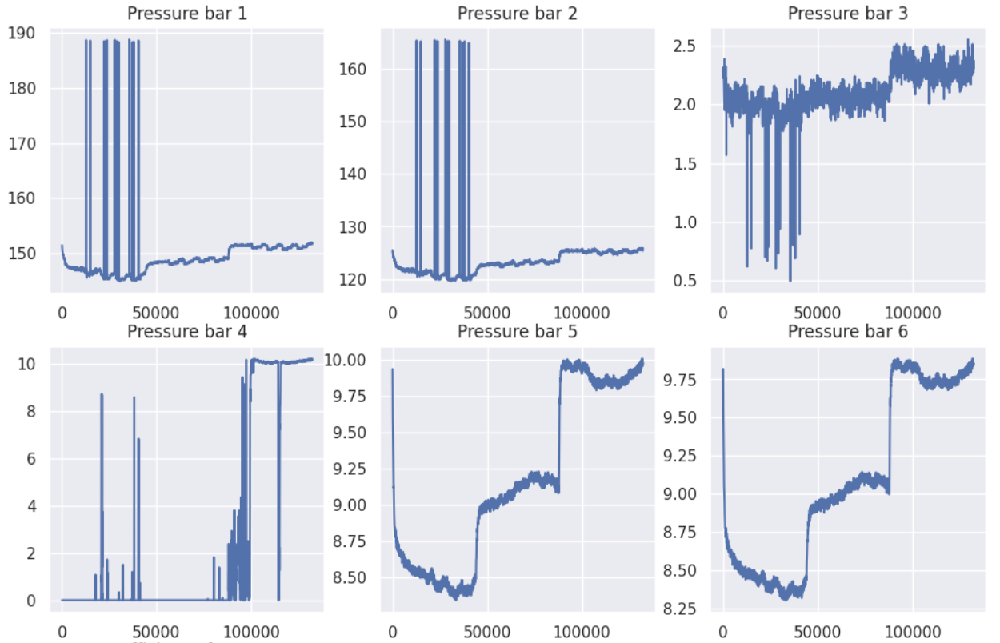
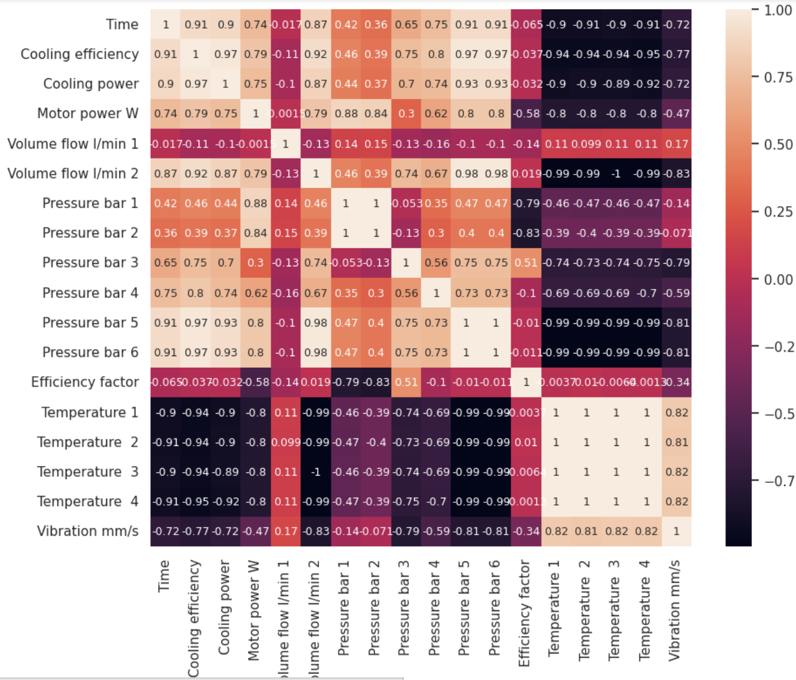
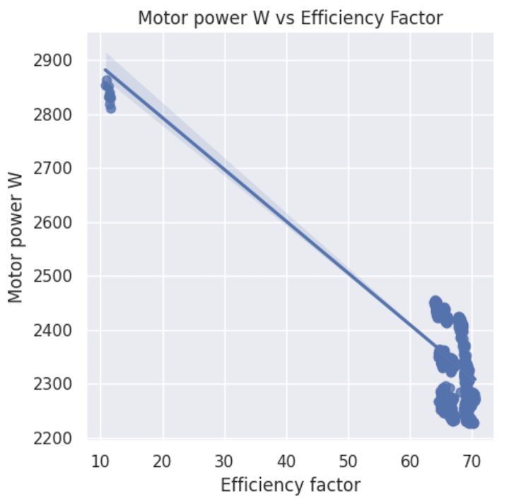
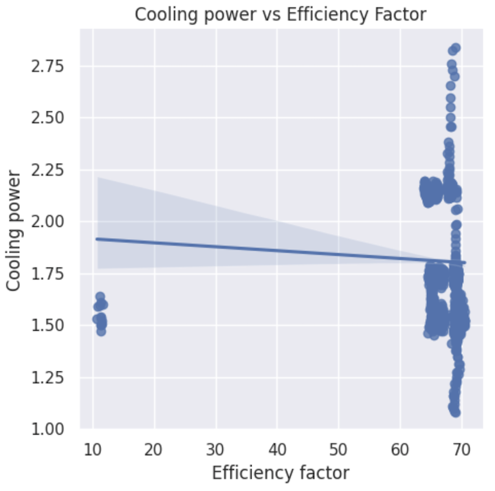
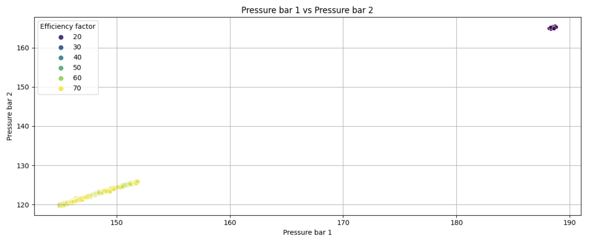
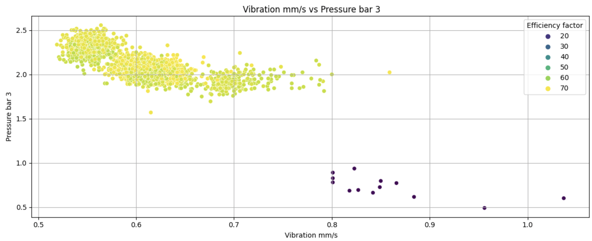
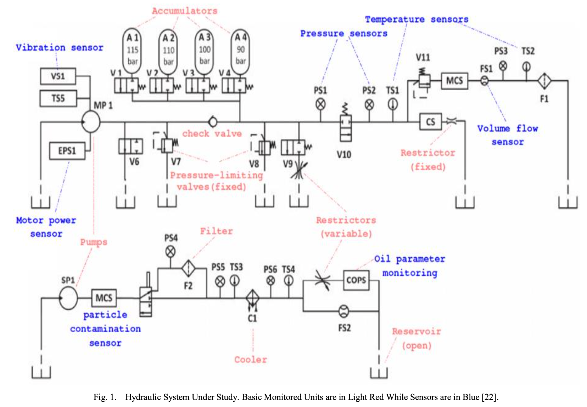

# MANUFACTURING OIL RIG

The first project is for an Industrial Manufacturing Company, which ficticious name is EnergyMobil.

Your role is to provide value to the company using the provided data to run the manufacturing plant more efficiently. 

### Data Analyst role
Create a manufacturing monitoring dasboard tht allows management to understand the manufacturing process in more detail.

### Dataset
The data comes from a real hydraulic rig system. This hydraulic rig is used to drill oil out of the ground. 

It has four main controls:
- the cooler setting
- the valve setting
- the pump seetting
- the accumulator setting

The rig has sensors in differenct areas measuring the pressure, volumetric flows, and temperatures. 

The original dataset is from [UCI Machine Learning Repository](https://archive.ics.uci.edu/ml/machine-learning-databases/00447/). A combined dataset is provided at [AveryData Github page](https://github.com/AveryData/hp-pred), [HourlyData.csv](https://github.com/AveryData/hp-pred/blob/main/HourlyData.csv) file. 

### Analysis

The data analysis was done on Google Colab using Python with Pandas, Matplotlib, Seaborn, and Skit-learn. The notebook is in the 1_Manufacturing folder.

The data was pre-processed, and all sensor's information are compiled in one file with no missing values. After importing I checked the data types and stastistics of the features, then I created some graphs to understand how each feature behaved over time.

In the correlation matrix we can check how the features correlate to each other:

Analysing the matrix, we can note that there is a perfect positive correlation between :
- Temperature 1,2,3 and 4
- Pressure bar 1 and 2
- Pressure bar 5 and 6 

also there is a perfect negative correlation between:
- Volume flow l/min 2 and Temperature 3

The features that have the greater impact on the **Efficiency factor** are **Pressure bar 1 and 2**, with a negative correlation greater than 0.7, followed by **Motor power**. With a small negative correlation of  0.34, **Vibration** also has an impact on the efficiency of the system.  **Pressure bar 3** has a positive correlation greater than 0.5. All other sensors have a close to zero correlation with Efficiency factor, which translates to not having a significant impact on the overall efficiency.

To confirm the relationships, I plotted the linear regression of all sensors against Efficiency factor. It is clear when a sensor has an impact on efficiency when we compare the results. 

**But how the other high correlations may affect the efficiency?**

To answer this question adn confirm the findings from the correlation matrix, I created a list with all correlations above +-0.7 and created plots to visualize how these pairs affect the efficiency of the system. 
The graphs can clearly show that the system is affected when the following sensors reach the following thresholds:

    - Cooling power < 1.75
    - Motor power > 2500 
    - Pressure bar 1 > 160 
    - Pressure bar 2 > 130
    - Pressure bar 3 < 1
    - Vibration >= 0.8 
 
Here are some examples of a scatter plot showing how the correlated features affects the efficiency.

**To conclude, to maintain an efficient system it is crucial to monitor the sensors Pressure bar 1,2,3, Motor power, and vibration.**

### Dashboard

After the analysis, a dashboard was created to monitor the system. 

### References

This is the summary from the UCI database files `description.txt` and `documentation.txt`:

**Relevant Information:**

The data set was experimentally obtained with a hydraulic test rig. This test rig consists of a primary working and a secondary cooling-filtration circuit which are connected via the oil tank. The system cyclically repeats constant load cycles (duration 60 seconds) and measures process values such as pressures, volume flows and temperatures while the condition of four hydraulic components (cooler, valve, pump and accumulator) is quantitatively varied.

**Number of Instances:** 2205

**Number of Attributes:** 43680 (8x60 (1 Hz) + 2x600 (10 Hz) + 7x6000 (100 Hz))

**Attribute Information:**

- Attributes are sensor data (all numeric and continuous) from measurements taken at the same point in time, respectively, of a hydraulic test rig's working cycle.
- The sensors were read with different sampling rates, leading to different numbers of attributes per sensor despite they were all exposed to the same working cycle.
   
   1. Pressure sensors (PS1-6): 100 Hz, 6000 attributes per sensor (6 sensors)
   2. Motor power sensor (EPS1): 100 Hz, 6000 attributes per sensor (1 sensor)
   3. Volume flow sensors (FS1/2): 10 Hz, 600 attributes per sensor (2 sensors)
   4. Temperature sensors (TS1-4): 1 Hz, 60 attributes per sensor (4 sensors)
   5. Vibration sensor (VS1): 1 Hz, 60 attributes per sensor (1 sensor)
   6. Efficiency factor (SE): 1 Hz, 60 attributes per sensor (1 sensor)
   7. Virtual cooling efficiency sensor (CE): 1 Hz, 60 attributes per sensor (1 sensor)
   8. Virtual cooling power sensor (CP): 1 Hz, 60 attributes per sensor (1 sensor)

**Missing Attribute Values:** None

**Attribute Information:** 

The data set contains raw process sensor data with the rows representing the cycles and the columns the data points within a cycle. The sensors involved are:

Sensor	|	Physical quantity	|	Unit	|	Sampling rate
--------|-----------------------|-----------|-----------------
PS1	|	Pressure	|		bar	|	100 Hz
PS2	|	Pressure	|		bar	|	100 Hz
PS3	|	Pressure	|		bar	|	100 Hz
PS4	|	Pressure	|		bar	|	100 Hz
PS5	|	Pressure	|		bar	|	100 Hz
PS6	|	Pressure	|		bar	|	100 Hz
EPS1	|	Motor power		|	W	|	100 Hz
FS1	|	Volume flow		|	l/min	|	10 Hz
FS2	|	Volume flow		|	l/min	|	10 Hz
TS1	|	Temperature		|	∞C	|	1 Hz
TS2	|	Temperature		|	∞C	|	1 Hz
TS3	|	Temperature		|	∞C	|	1 Hz
TS4	|	Temperature		|	∞C	|	1 Hz
VS1	|	Vibration		|	mm/s	|	1 Hz
CE	|	Cooling efficiency (virtual)|	%	|	1 Hz
CP	|	Cooling power (virtual)	|	kW	|	1 Hz
SE	|	Efficiency factor	|	%	|	1 Hz

### Diagram of the System

Source: Alenany, A., Helmi, A. M., & Nasef, B. M. (2021). Comprehensive Analysis for Sensor-based Hydraulic System Condition Monitoring. International Journal of Advanced Computer Science and Applications, 12(6), 153-162.
